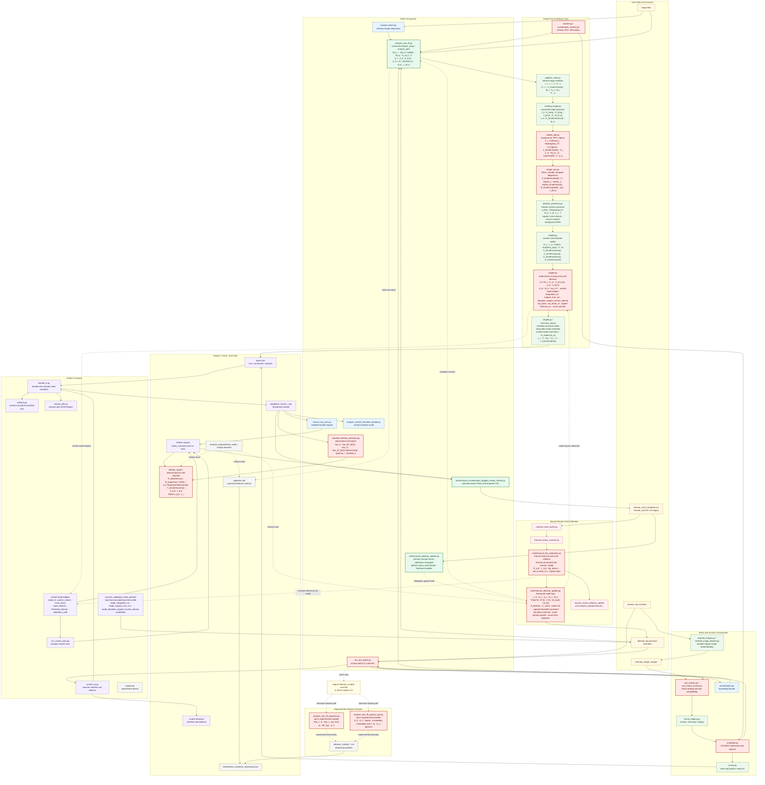
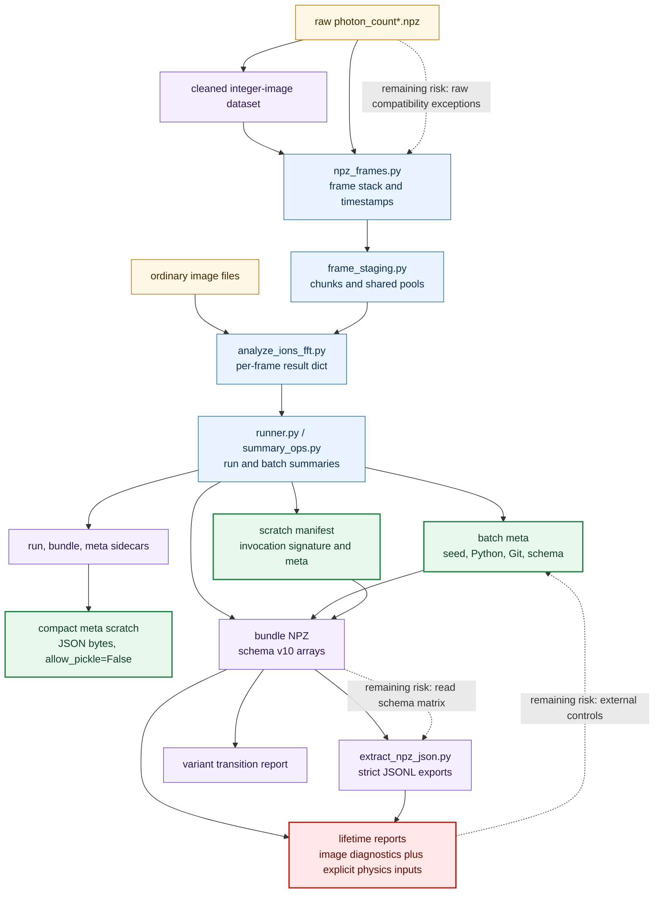
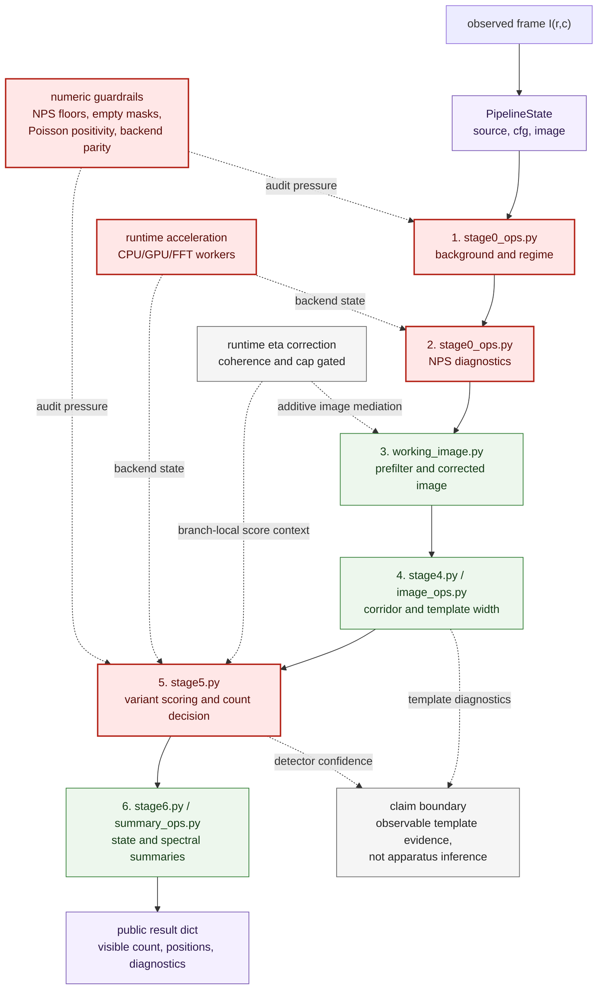
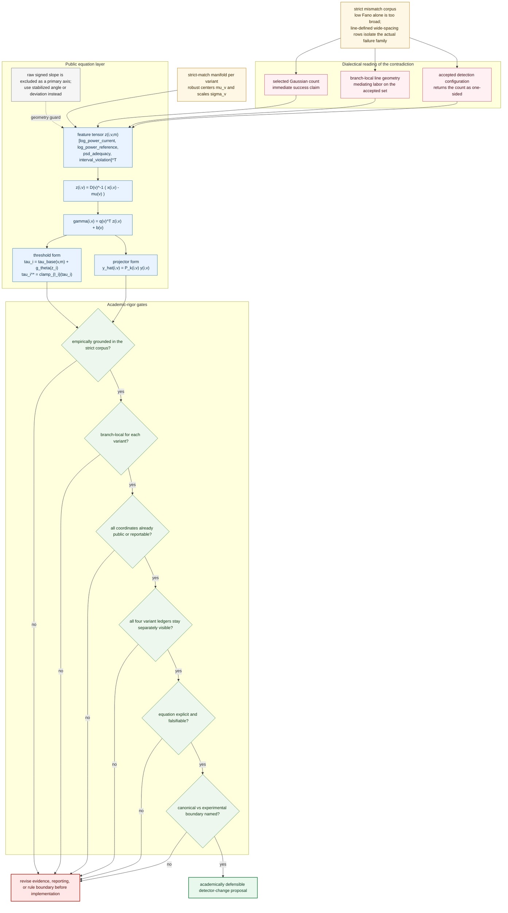
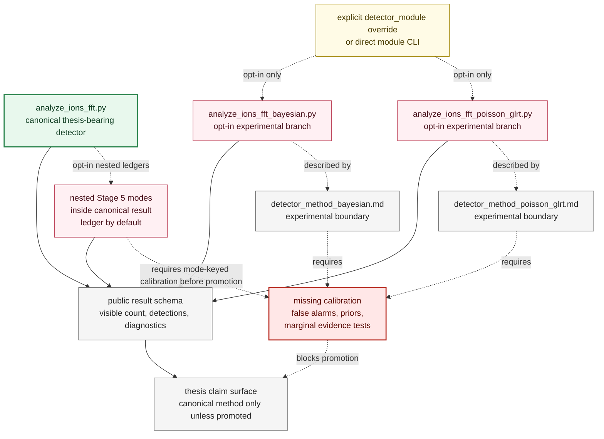

# TrapDetect Project Diagram And Critique

This document is an architecture review surface, not a claim that the project
infers unobserved apparatus details or completes all thesis validation. Solid arrows
show runtime or data flow. Dotted arrows show claim, calibration, or audit
influence. Green nodes are relatively well-owned contracts. Red nodes are risk
concentrators surfaced by the thesis audit.

## Answer Surface Ownership

| Document | Owns |
| --- | --- |
| `README.md` | Operator setup, direct CLI commands, validation commands, and project-file map |
| `algorithm.md` | Canonical detector contract, Stage 5 mode tensor equations, claim boundary, and scientific method wording |
| `notes/project_architecture_mermaid.md` | Architecture/data-flow diagrams, risk matrix, and cross-document ownership |
| `notes/thesis_academic_dictionary.jsonl` | Symbol definitions, validation-boundary records, notation audits, and thesis answer rules |

## Project Architecture

## Parallelization And Cleanup Viability

This view isolates the runtime parallel surfaces that matter for memmap cleanup.
It is intentionally narrower than the full architecture graph above. The main
code-side conclusion is that the current `memmap_pool` transport is likely worth
preserving, and the first viable fixes should operate on ownership and cleanup at
the existing orchestration boundaries rather than removing shared-file transport.

```mermaid
flowchart LR
    classDef input fill:#fff7e6,stroke:#b87503,color:#3f2900
    classDef control fill:#e8f3ff,stroke:#2f6f9f,color:#0f2e4d
    classDef process fill:#edf7ed,stroke:#2f7d32,color:#143d16
    classDef artifact fill:#f4efff,stroke:#7756b3,color:#2c174f
    classDef risk fill:#ffe7e7,stroke:#b42318,color:#5c0b05,stroke-width:2px
    classDef note fill:#fffbe6,stroke:#a18400,color:#4a3b00
    classDef strong fill:#e8f8ed,stroke:#27824a,color:#103d22,stroke-width:2px

    NPZQueue["camera .npz archive queue"]:::input
    RunConfig["run_npz_batch.py\njoblib backend, reuse flag, chunk mode"]:::control
    LoaderPool["loader/stager thread pool\nload_next_chunk and stage_one_joblib_run"]:::process
    FrameStaging["frame_staging.py\nopen_memmap write, flush, writer close"]:::process
    FramePool["scratch/frame_pool/*.npy\nshared memmap transport"]:::artifact
    JoblibPool["joblib/loky worker pool\nreused worker processes"]:::risk
    WorkerCache["_FRAME_POOL_WORKER_CACHE\nper-worker mapped arrays"]:::risk
    Detector["analyze_ions_fft.py\nper-frame detector work"]:::strong
    PendingFlush["pending run results\nflush thresholds and run finalization"]:::process
    ScratchSidecars["scratch sidecars\nrun__, frames__, bundle__, meta__"]:::artifact
    BundleOutput["bundle and batch meta\nresult NPZ and summaries"]:::artifact
    CacheBarrier["candidate fix\nworker-side cache-clear barrier before unlink"]:::note
    Unlink["_release_staged_pool_path\nunlink pool path and remove empty dir"]:::process
    DeferredDelete["deferred_staged_pool_paths\nretry at final cleanup"]:::risk
    BatchScratch["cleanup_batch_scratch()\nrmtree scratch after outputs consumed"]:::artifact
    WindowsPressure["Windows file cache / standby pressure\ncan outlive Python heap release"]:::note

    NPZQueue --> RunConfig --> LoaderPool --> FrameStaging --> FramePool
    FramePool --> JoblibPool --> WorkerCache --> Detector --> PendingFlush
    PendingFlush --> ScratchSidecars --> BundleOutput
    FramePool --> Unlink
    WorkerCache -. mapped view may still be live .-> Unlink
    Unlink -. OSError or sharing conflict .-> DeferredDelete
    DeferredDelete --> BatchScratch
    ScratchSidecars --> BatchScratch
    CacheBarrier -. clear worker-owned mappings first .-> WorkerCache
    FramePool -. shared-file lifetime surface .-> WindowsPressure
    WorkerCache -. reused processes can retain views .-> WindowsPressure
    DeferredDelete -. cleanup lag symptom .-> WindowsPressure
```

### Most Viable Code-Side Fixes

- Highest viability: add a worker-side cache-clear barrier before pool unlink so
  each worker releases its own `_FRAME_POOL_WORKER_CACHE` entries before the
  coordinator expects `pool_path.unlink()` to succeed.
- High viability: add lifecycle instrumentation at `_frame_pool_array`,
  `_clear_frame_pool_worker_cache`, `_release_staged_pool_path`, and final
  deferred cleanup so unlink failures can be tied to specific pool paths and
  worker-owned mappings.
- Medium viability: reduce staged-file churn by preferring fewer pool files per
  run, for example `frame_pool_chunk_mode="single"` or other less fragmented
  layouts, before attempting to remove memmap transport.
- Lower viability at the first pass: force frequent worker restarts or replace
  NumPy memmap with lower-level Windows-specific mapping code. Those are fallback
  options once the current ownership model is exhausted.

## Data Lineage And Provenance

## Single-Frame Detector Stages

## Manual Calibration Feedback Loop

```mermaid
flowchart LR
    classDef review fill:#fff0f3,stroke:#bd4259,color:#4a111b
    classDef process fill:#e8f3ff,stroke:#2f6f9f,color:#0f2e4d
    classDef artifact fill:#f4efff,stroke:#7756b3,color:#2c174f
    classDef risk fill:#ffe7e7,stroke:#b42318,color:#5c0b05,stroke-width:2px
    classDef guard fill:#e8f8ed,stroke:#27824a,color:#103d22,stroke-width:2px

    ReviewExport["tools/manual_review/export_flagged_review_frames.py<br/>selected review PNGs + template CSV<br/>limit controls review-set size"]:::process
    ManualCounts["manual_count_template.csv<br/>repo root or copied detector-update CSV<br/>source: C:/Users/isaia/Desktop/run3_5926_precleaned"]:::review
    DatasetNPZ["manual_review_detector_update/manual_test_data_from_manual_count_template.npz<br/>explicit rebuild or default auto-resolution"]:::artifact
    Contract["manual_review_contract.py<br/>review schema and labels"]:::review
    EtaTool["tools/manual_eta_calibration.py<br/>branch residual ledgers"]:::process
    Geometry["matched-count chain geometry<br/>multi-ion spacing and line-fit stats"]:::guard
    BranchEvidence["branch-local evidence<br/>all four public variants:<br/>anisotropic/symmetric x gaussian/poisson"]:::artifact
    IntervalFit["interval-censored threshold fit<br/>per (variant, mode)<br/>strict rows first"]:::process
    BoundaryAudit["score-domain and boundary audit<br/>tau_lo < tau <= tau_hi<br/>signed movement caps"]:::guard
    RuntimeGate["runtime gates<br/>coverage, coherence, cap"]:::guard
    EtaArtifacts["signed score-admissibility and variant-count-legibility NPZs<br/>canonical + per-configured Stage 5 mode"]:::artifact
    UpdateTool["tools/manual_detector_update.py<br/>fixed-point audit loop<br/>one canonical solve + one subpass per configured Stage 5 mode"]:::risk
    PeakRule["peak_min_distance<br/>mean spacing / 5"]:::guard
    Override["manual_detector_override.jsonl<br/>config influence"]:::artifact
    StablePresets["manual_calibrated_mode_presets/<mode_id><br/>stable preset bundle for analyze_ions_fft.py / run_npz_batch.py"]:::artifact
    CandidateModes["current promotion candidates<br/>mode_integrated_snr ; mode_support_sum_snr ; mode_template_support_excess_density<br/>strict corpus: 113/113 each"]:::guard
    Canonical["analyze_ions_fft.py<br/>canonical validation path"]:::process
    Report["manual detector update report<br/>mismatch deltas, signed movement,<br/>boundary interval status, mode artifact paths"]:::risk

    ReviewExport --> ManualCounts
    ManualCounts --> Contract --> EtaTool --> BranchEvidence --> IntervalFit --> BoundaryAudit --> RuntimeGate
    ManualCounts --> DatasetNPZ --> UpdateTool
    EtaTool --> Geometry --> PeakRule --> Override
    RuntimeGate --> EtaArtifacts --> UpdateTool --> Override --> Canonical
    EtaArtifacts --> StablePresets --> Canonical
    Canonical --> EtaTool
    UpdateTool --> Report
    Geometry --> Report
    StablePresets --> CandidateModes
    Report -. current status: audit frontier .-> Canonical
```

## Detector-Change Academic-Rigor Verification

This view is a pre-implementation gate for the planned geometry-anomaly update.
The change is only academically defensible if the contradiction stays tied to
the strict mismatch corpus, the rule stays equation-explicit and branch-local,
and the reports keep all four variant ledgers separately visible.

## Experimental Variants And Claim Boundary

## What Is Strong

- Public entrypoints are clear: `analyze_ions_fft.py`, `analyze_batch.py`,
  `run_npz_batch.py`, `extract_npz_json.py`, `tools/manual_review/export_flagged_review_frames.py`, `tools/manual_detector_update.py`, and
  `calculate_lifetime_precision.py` form a readable mainline chain.
- The single-frame detector has a stable six-stage contract, and the current
  docs now keep that contract inside observable image-local outputs.
- Batch provenance is improving: the batch path now carries an invocation
  signature, deterministic seed, Python/Git metadata, and persisted relocated
  scratch manifest metadata.
- Compact run metadata scratch now has a safer contract: JSON-byte fields load
  with `allow_pickle=False`, and legacy object-array metadata is rejected.
- Manual calibration preserves branch-local evidence instead of forcing every
  variant into one aggregate success story.
- The manual-review operator path is now explicit: selected review images and a
  template CSV can be generated first, the detector-update dataset is rebuilt or
  auto-resolved from that CSV, and the fixed-point update then emits canonical
  plus mode-specific artifacts without collapsing the four public variants.
- The accepted post-fixed-point manual-calibrated presets now live in the
  repo-local `manual_calibrated_mode_presets/` bundle, so operator-facing
  preset flags do not depend on preserving a historical `analysis_outputs/...`
  investigation tree.
- Manual calibration now reports matched-count chain geometry separately from
  residual eta: 0/1-ion matched frames remain valid residual-calibration rows,
  while only multi-ion matched frames enter spacing and line-fit summaries.
- The current strict-corpus promotion candidates are narrower than the full
  preset set: `mode_integrated_snr`, `mode_support_sum_snr`, and
  `mode_template_support_excess_density` each match `113 / 113` strict scored
  rows from `manual_count_template.csv`, while `manual_calibrated_canonical`
  and `mode_support_mean_excess_snr` remain at `111 / 113`.
- The test suite already exercises many serious contracts around manual update,
  NPZ batch behavior, strict JSONL, NaN handling, and bundle readability.

## Where The Architecture Is Fragile

- `run_npz_batch.py` is the largest risk concentrator. It owns CLI behavior,
  cleaned-data preparation, scheduling, scratch, provenance, bundle writing,
  resume, and GPU/CPU routing.
- Runtime state crosses process boundaries through globals, worker initializers,
  and optional GPU/CuPy configuration. The project needs metadata and tests to
  keep this from becoming invisible nondeterminism.
- Artifact policy is better but not complete. Distribution bundles and compact
  meta scratch are moving toward pickle-free contracts, while raw-ingestion and
  historical compatibility paths still need a named exception boundary.
- Stage 4 and Stage 5 remain the detector-numeric pressure points: template
  diagnostics, matched response floors, Poisson positivity, and backend parity
  all affect visible-count confidence without requiring any optics claim.
- Manual fixed-point calibration is an audit frontier. Reports should continue
  to expose promoted IDs, mismatch deltas, guard counts, and runtime gating
  rather than implying final parity. The new matched-count geometry summary
  improves peak-spacing provenance, but it does not convert the fixed-point
  loop into a parity proof.
- The remaining signed-threshold risk is not cap size alone. The fit must
  receive exact accepted/rejected boundary scores and enough spectral variation
  to move hard overcount rows; otherwise the artifact silently falls back to a
  placeholder interval and under-reacts even when large positive movement is
  mathematically required.
- Lifetime outputs are downstream estimators over camera-observed visible-count
  epochs. They still require explicit external physics inputs and bias studies
  before supporting a stronger physical lifetime claim.
- Experimental Bayesian and Poisson/GLRT modules preserve the result schema, but
  they are not on the default canonical path. They currently appear only through
  explicit detector-module selection or direct module invocation, and their
  names and docs must remain bounded until false-alarm, prior, and likelihood
  calibration are added.

## Risk Matrix

| Risk surface | Diagram location | Current status | Why it matters | Next action | Validation |
| --- | --- | --- | --- | --- | --- |
| Claim-boundary drift | `Algorithm`, `Dictionary`, method docs | Improved, still easy to regress | Thesis language can overstate what image evidence proves | Keep wording tied to observable template evidence | Search docs for overclaim phrases and review dictionary public criteria |
| Deterministic provenance | `NPZBatch`, `BatchMeta`, `ScratchManifest` | Seed and Python/Git metadata added | Batch results must be replayable and auditable | Add dependency-version provenance and repeat-run comparison | Small deterministic repeat-run pytest |
| Artifact pickle/schema safety | `BundleIO`, `ScratchIO`, `Artifacts`, `SharedUtils` | Compact meta scratch hardened | Unsafe or ambiguous NPZ members can poison downstream exports | Finish bundle read schema validation and raw-ingestion exception docs | Bundle compatibility and `allow_pickle=False` tests |
| Numeric guardrails | `Stage0`, `ImageOps`, `Stage5` | Partly guarded, audit still flags edges | Tiny floors or empty masks can alter count confidence | Add tests for NPS floors, Poisson floors, empty masks, FFT parity | Focused detector numeric pytest slice |
| Mode tensor claim drift | `Stage5`, `ModeLedgers`, `EtaCalibration`, `DetectorUpdate` | Implemented with remaining promotion risk | Experimental score modes can look canonical if mode provenance and artifact basis are hidden | Keep ledgers nested under public variants, keep CLI score modes ledger-only, use support-based score names, and require mode-keyed calibration before promotion | Canonical default invariance tests plus mode artifact provenance tests |
| Score-domain and signed-threshold movement | `Stage5`, `EtaCalibration`, `DetectorUpdate`, `ModeLedgers` | Runtime signed movement implemented; artifact interval fit still fallback-prone in some cells | Runtime floors can dominate artifacts unless exact accepted/rejected boundary scores and manual-count intervals reach the fit | Persist exact boundary scores into calibration rows, fit per-(variant, mode) intervals directly, and verify the fit displaces remaining strict overcount rows | Score-domain tests, old-artifact fallback tests, signed runtime-adjustment tests, and 120-frame selected-mode matrix rerun |
| Background-noise support provenance | `Primitives`, `ImageOps`, `Stage5` | Implemented with validation pressure | Full-image analysis can bias candidate SNR if support scores use tiny local annuli as the only noise source | Prefer source-masked full-frame or full-ROI background RMS for support scores, emit local annulus diagnostics, and record fallback reason | Synthetic source-mask test plus refinement provenance assertions |
| Manual geometry calibration | `EtaCalibration`, `PeakRule`, `Report` | Multi-ion matched-count spacing surfaced; 0/1-ion rows excluded from geometry denominators | Peak-search spacing now has auditable image evidence instead of a bare heuristic | Keep line-fit and spacing summaries visible in eta and update reports | `tests/test_manual_eta_calibration.py` and `tests/test_manual_detector_update.py` |
| Manual fixed-point parity | `EtaCalibration`, `DetectorUpdate`, `Report` | Explicitly non-final | Calibration reports can hide per-variant regressions | Surface promoted IDs and per-variant mismatch deltas in every final report | `tests/test_manual_detector_update.py` |
| Lifetime physics overreach | `Lifetime`, `LifetimeReport` | Claim boundary improved | Camera epochs are not external apparatus physics | Add finite-window diagnostics and pseudodata bias study | `tests/test_lifetime_precision.py` plus new bias tests |
| Experimental variant calibration | `Bayesian`, `Poisson`, `Calibration` | Exploratory | Names can sound stronger than validation | Add false-alarm and prior calibration or keep wording experimental | Variant-specific calibration tests |
| Root module sprawl | `PublicEntrypoints`, `BatchCore`, facades | Manageable but crowded | Ownership gets hard to reason about | Extract only proven stable helpers from `run_npz_batch.py` | Existing NPZ batch tests stay green |
| GPU/backend parity | `Runtime`, `Scheduler`, `Stage5` | Metadata visible, broad parity not proven | Silent fallback can be mistaken for parity | Add deterministic CPU/GPU kernel parity where environment supports it | Optional GPU parity test marker |
| Test-suite heaviness | audit and validation surfaces | Strong but uneven | Slow or environment-dependent tests can hide regressions | Mark slow tests and keep focused slices for each contract | CI grouping and targeted pytest commands |

## What The Diagram Makes Visible

1. The canonical science claim is owned by `analyze_ions_fft.py` and
   `algorithm.md`, not by the experimental detector branches.
2. Batch reproducibility is mostly an orchestration concern, so improvements
   must land in `run_npz_batch.py`, `scratch_io.py`, `bundle_io.py`, and schema
   helpers before they become visible downstream.
3. Manual calibration feeds back through configuration, runtime eta gates, and
  the peak-spacing rule. The geometry path is auditable image evidence, not an
  independent proof of detector parity.
4. Lifetime reports are downstream consumers of detector evidence plus explicit
   physical inputs; they should not be used to widen single-frame claims.
5. The cleanest next engineering split is not a broad refactor. It is to peel
   stable artifact/schema and numeric-guard helpers away from the high-gravity
   batch orchestrator once tests pin their contracts down.

## Recommended Iteration Order

1. Finish bundle read schema validation and historical compatibility tests.
2. Sweep remaining `allow_pickle=True` sites and name the raw-ingestion-only
   exceptions explicitly.
3. Add detector numeric guard tests for NPS floors, empty masks, Poisson floors,
   and backend parity.
4. Add lifetime finite-window diagnostics, dropped-row reporting, and a
   pseudodata bias harness before strengthening physics-language claims.
5. Keep Bayesian and Poisson/GLRT paths schema-compatible and exploratory until
   calibration tests justify promotion.
6. Split `run_npz_batch.py` only where a helper already has a proven stable
   contract and a focused test anchor.
